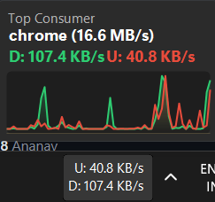

A minimal, native network speed monitor that lives in your Windows 11 taskbar. No bloat, no electron, no background services beyond itself.



## What it does

- Shows live upload and download speeds directly on the taskbar
- Hover to get a flyout graph of the last 60 seconds of traffic, top process consuming bandwidth, and current speeds
- Right-click for settings and controls
- Fades out automatically when the network is idle
- Detects your system theme and renders accordingly

## Installation

Download `BitBar.exe` from [Releases](https://github.com/FTS18/BitBar/releases) and run it.

Requires the [.NET 10 Desktop Runtime (x64)](https://dotnet.microsoft.com/download/dotnet/10.0/runtime) — 55 MB one-time install.

### Windows SmartScreen warning

On first run, Windows will show a blue "Windows protected your PC" dialog. This happens to every new unsigned executable regardless of what it does.

1. Click **More info**
2. Click **Run anyway**

That's it. The warning won't appear again.

### Install to Program Files (optional)

Right-click `install.ps1` and choose Run with PowerShell. It will:
- Build and copy the binary to `C:\Program Files\BitBar`
- Create a Start Menu shortcut
- Register it to auto-start on boot via the registry

## Settings

Right-click the taskbar widget and select **Settings** to configure:

- **Network Adapter** - Auto-detect or pin to a specific interface (Wi-Fi, Ethernet, VPN)
- **Display Units** - MB/s (bytes) or Mbps (bits)
- **Refresh Rate** - 100ms to 5000ms

Settings are stored in `HKCU\Software\BitBar`.

## Building from source

Requires [.NET 10 SDK](https://dotnet.microsoft.com/download/dotnet/10.0).

```
cd windows
dotnet build
dotnet run
```

To produce a single-file release binary:

```
dotnet publish -c Release -r win-x64 -p:PublishSingleFile=true --self-contained false
```

## Requirements

- Windows 10 22H2 or later (Windows 11 recommended)
- [.NET 10 Desktop Runtime (x64)](https://dotnet.microsoft.com/download/dotnet/10.0/runtime)
- A taskbar

## License

MIT
